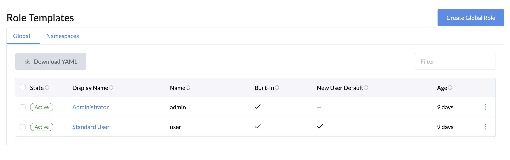

## An Open-source Cloud-native AI Infrastructure Platform, Not Just GPUs

## What is LLMOS?

We are thrilled to announce the launch of **LLMOS**, an open-source cloud-native AI infrastructure platform designed to simplify the management of AI applications and Large Language Models (LLMs). With LLMOS, organizations can effortlessly deploy, scale, and operate machine learning workflows while reducing the complexity often associated with AI development and operations.

## Why We Built LLMOS

AI and LLMs are transforming industries, but managing the infrastructure needed for AI at scale can be challenging. We built **LLMOS** to break down these barriers, providing a platform that makes it easier for developers, data scientists, and IT teams to focus on what really matters—building and deploying powerful AI solutions. With its cloud-native foundation, LLMOS integrates smoothly with existing infrastructure, offering a flexible, scalable, and user-friendly way to manage AI projects and tasks.

## Key Features of LLMOS

### 1. Seamless Notebook Integration

LLMOS integrates with popular notebook environments such as **Jupyter**, **VSCode**, and **RStudio**, enabling data scientists and developers to work efficiently in familiar tools without complicated setup.


### 2. ModelService for LLM Deployment

Deploying LLMs is now simpler with **ModelService**, which provides **OpenAI-compatible APIs** for serving large language models. This feature makes it easy to deploy, scale, and use LLMs in real-world applications.


### 3. Machine Learning Cluster

The **Machine Learning Cluster** supports distributed computing, offering parallel processing and access to leading AI libraries. This feature enhances the performance of machine learning workflows, especially for large-scale models and datasets.


### 4. Scalable Storage with Rook Ceph

**Rook Ceph** provides distributed and fault-tolerant storage system for LLMOS, offering robust, scalable block and filesystem storage that adapts to the needs of AI and LLM applications.


### 5. Extensibility with Managed Addons

LLMOS introduces **ManagedAddon** support, allowing users to extend the platform with system and custom add-ons. This gives organizations more flexibility to tailor the platform to their specific needs.

### 6. Simplified User and API Key Management

The platform features an intuitive interface for managing **users** and **API keys**, making access control and resource allocation easier for administrators.


### 7. Role-Based Access Control (RBAC) and Role Templates

LLMOS offers enhanced **Role Templates** and **RBAC**, helping administrators assign permissions and manage security across teams and projects with ease.



### 8. Node Management

**Node Management** is available directly through the LLMOS dashboard, allowing for better visibility and control over system resources, enhancing operational efficiency.


### 9. Bootstrap and Installation Support

Setting up LLMOS has been simplified through easy-to-use **[installation script](https://llmos.1block.ai/docs/installation/)** and comprehensive **[bootstrap configurations](https://llmos.1block.ai/docs/installation/configurations)**, making it easy for users to get up and running.

### 10. Easy Upgrades

With streamlined upgrade capabilities, LLMOS ensures that you can quickly adopt new features and improvements with minimal disruption.

## LLMOS Use Cases

- **AI Research & Development:** Simplify the management of LLMs and AI infrastructure, allowing researchers to focus on innovation rather than operational overhead.
- **Enterprise AI Solutions:** Streamline the deployment of AI applications with scalable infrastructure, making it easier to manage models, storage, and resources across multiple teams.
- **Data Science Workflows:** With notebook integration and powerful cluster computing, LLMOS is ideal for data scientists looking to run complex experiments at scale.
- **AI-Driven Products:** From chatbots to automated content generation, LLMOS simplifies the process of deploying LLM-based products that can serve millions of users and scale up horizontally.

## Getting Started with LLMOS

Ready to get started with **LLMOS**? Our [detailed documentation](https://llmos.1block.ai/docs/) covers everything from installation to advanced features. Whether you’re a developer, data scientist, or system administrator, you’ll find LLMOS easy to set up and use, below is the quick-start guideline.

:::note
  Make sure your nodes meet the [requirements](https://llmos.1block.ai/docs/installation/requirements) before proceeding.
:::

##### Installation Script

LLMOS can be installed to a bare-metal server or a virtual machine. To bootstrap a **new cluster**, follow the steps below:
```bash
curl -sfL https://get-llmos.1block.ai | sh -s - --cluster-init --token mytoken
```

To monitor installation logs, run `journalctl -u llmos -f`.

If your environment requires internet access through a proxy, set the `HTTP_PROXY` and `HTTPS_PROXY` environment variables before running the installation script:
```bash
export HTTP_PROXY=http://proxy.example.com:8080
export HTTPS_PROXY=http://proxy.example.com:8080
export NO_PROXY=127.0.0.0/8,10.0.0.0/8,172.16.0.0/12,192.168.0.0/16 # Replace the CIDRs with your own
```

##### Getting Started

After installing LLMOS, access the dashboard by navigating to `https://<server-ip>:8443` in your web browser.

1. LLMOS will create a default `admin` user with a randomly generated password. To retrieve the password, run the following command on the **cluster-init** node:

   ```shell
   kubectl get secret --namespace llmos-system llmos-bootstrap-passwd -o go-template='{{.data.password|base64decode}}{{"\n"}}'
   ```
    
1. Upon logging in, you will be redirected to the setup page. Configure the following:
  - Set a **new password** for the admin user (strong passwords are recommended).
  - Configure the **server URL** that all other nodes in your cluster will use to connect.

1. After setup, you will be redirected to the home page where you can start using LLMOS.


## More Examples

To learn more about using LLMOS, explore the following resources:

- [Chat with LLMOS Models](https://llmos.1block.ai/docs/user_guide/llm_management/serve)
- [Creating a Jupyter Notebook](https://llmos.1block.ai/docs/user_guide/llm_management/notebooks#create-a-notebook)
- [Creating a Machine Learning Cluster](https://llmos.1block.ai/docs/user_guide/ml_clusters)

## Join Us

We are excited to build a community around the project. If you're interested, please join us on [Discord](https://discord.gg/5BnNqC5ccB) or participate in [Github Discussions](https://github.com/llmos-ai/llmos/discussions) to discuss or contribute the project. If you need to contact us, please reach out to us via [here](https://1block.ai/contact-us). We look forward to collaborating with you, thanks!
