## **🚀 Introducing LLMOS v0.2**

**LLMOS** is a cloud-native tool designed to **accelerate AI application development** and **simplify the management of large language models (LLMs)**. It supports deployment on both **public clouds** and **private GPU servers**, enabling you to easily deploy private AI models, scale machine learning workflows, and reduce the complexity of development and operations.

With the increasing demand for GPU virtualization (vGPU) and resource utilization, the **v0.2** release prioritizes features like **vGPU management**, **cluster and GPU resource monitoring**, and **alerting** to maximize GPU management efficiency and utilization.

## **🌟 Key Features**

### **1. More Efficient GPU Management**

Introducing support for **NVIDIA Virtual GPU (vGPU)**, allowing you to choose between virtual or full GPUs based on your needs. This accelerates resource allocation and optimizes the utilization of GPU VRAM and CUDA cores.

| GPU Model | Support | Architecture |
| --- | --- | --- |
| A100, A200 | ✅ | NVIDIA Ampere |
| H100, H200 | ✅ | NVIDIA Hopper |
| Tesla T4/T4G | ✅ | NVIDIA Turing |
| 30x/40x Series | ✅ | Ada Lovelace/Ampere |

✔ **Virtual GPU (vGPU)**: Optimize GPU utilization and scale workloads seamlessly.

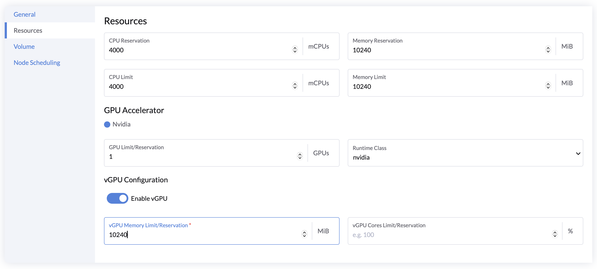
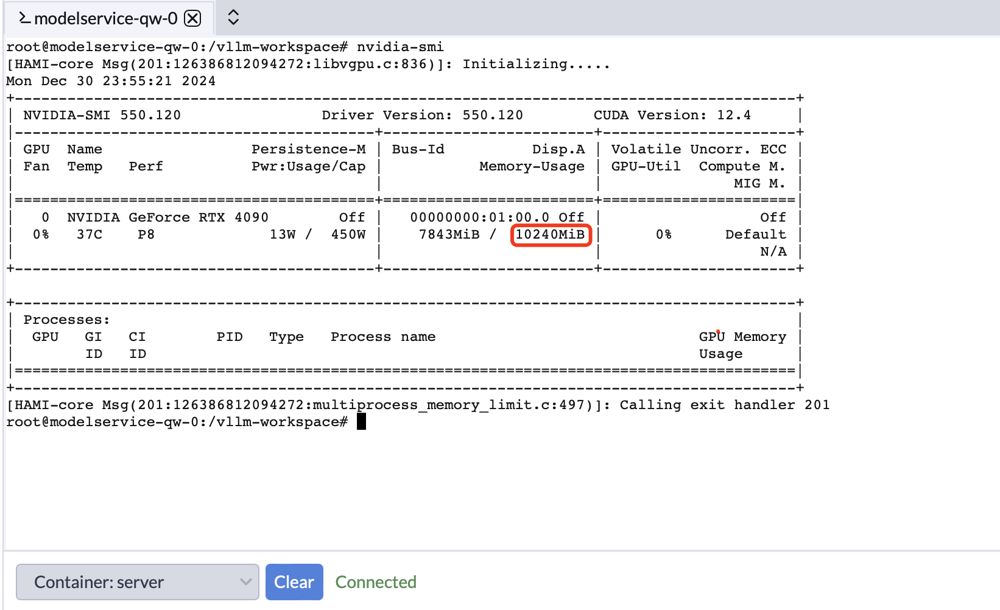

✔ **GPU Management Interface**: Intuitively view GPU details and monitor resources in real time.

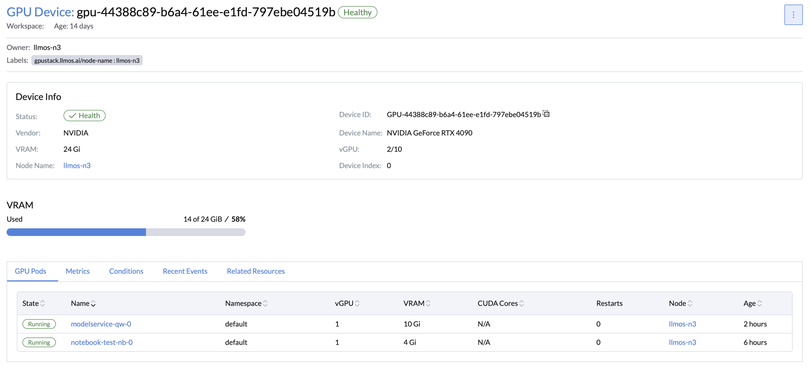
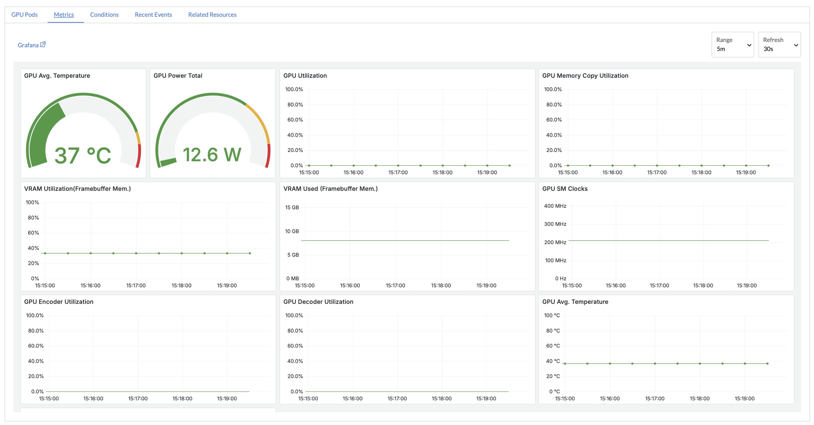

👉 [Learn More](https://llmos.1block.ai/docs/user_guide/gpu_management/enable-gpu-stack/)

### **2. Real-Time Monitoring and Alerts**

Enable GPU and cluster monitoring with a single click using preconfigured **Grafana dashboards and Prometheus alerts**. Track performance metrics in real time to ensure stable workload operations.

✔ **Real-Time Monitoring**: Stay informed about cluster and GPU status.

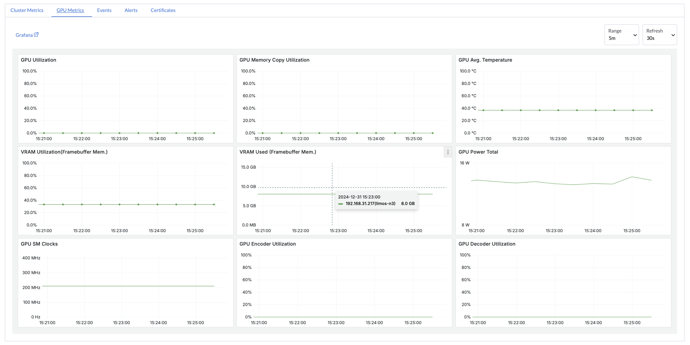

✔ **Intelligent Alerts**: Predefined rules to reduce risks of failures and downtime.

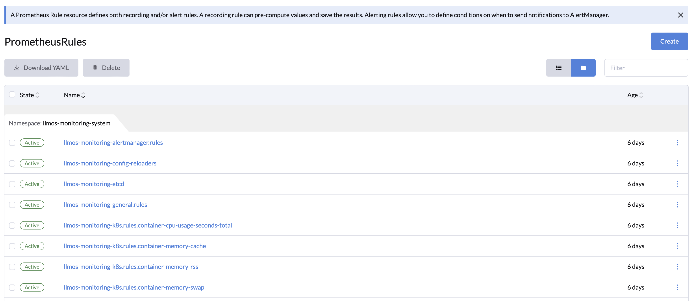

✔ **Pause and Resume Workloads**: Release idle resources to enhance efficiency.

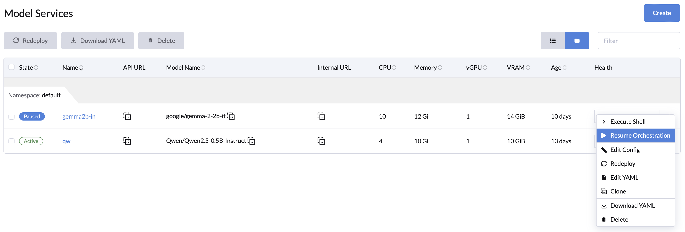

👉 [Learn More](https://llmos.1block.ai/docs/user_guide/monitoring/monitoring-management/)

## **⚡ Key Enhancements**

### **1. Faster Installation Experience**

- For CN users, you can accelerate installation with `--mirror cn`.
  ```bash
  curl -sfL https://get-llmos.1block.ai | sh -s - --cluster-init --token mytoken --mirror cn
  ```

- For restricted network and air-gap environments, use configurations like `globalSystemImageRegistry` or `registries` to integrate private image registries, accelerating and simplifying the installation process.


### **2. Expanded Model Service Sources**

Support loading AI models from [HuggingFace](https://huggingface.co/models), [ModelScope](https://modelscope.cn/models), or local paths, offering more flexibility in model deployment for your projects.

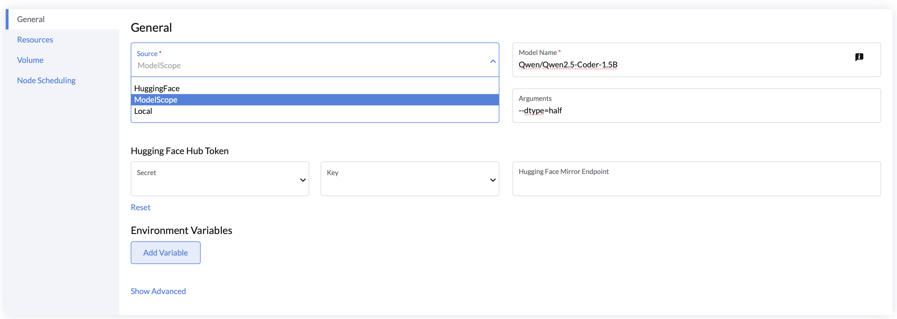


### **3. Optimized Workload Management**
- **Automatic Volume Cleanup**: Automatically release storage resources after workload deletion, simplifying management.
- **Notebook Optimization**: Added support for Jupyter Pipeline images and i18n localization(e.g., Chinese) patches.
  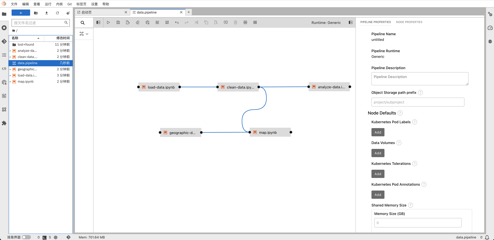
- **Node-Level GPU Metrics Optimization**: Gain detailed overviews of GPU resources to enable fine-grained management.
  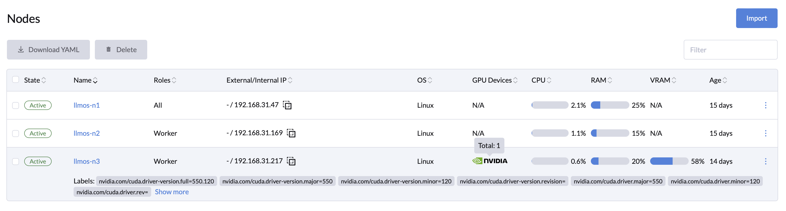
- **Enhanced Model Token Metrics**: View real-time model token usage and response speeds to optimize resource planning and task execution of model services.
  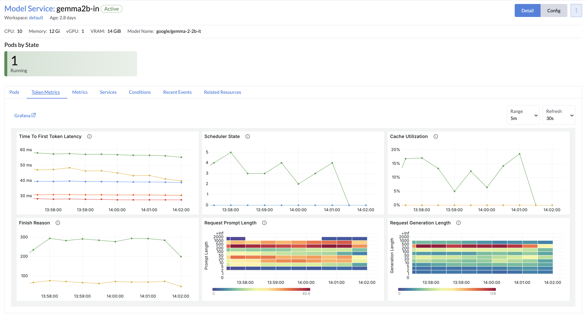

---

## **🛠 Updates and Fixes**

- **Dependency Updates**: System dependencies have been updated to improve performance, security, and compatibility:
  - Rook Ceph and Ceph cluster upgraded to `v1.15.7`.
  - Snapshot Controller upgraded to `v8.2.0`.
  - Upgrade Controller upgraded to `v0.14.2`.
- **Key Bug Fixes**:
  - **Model Service Parameter Issues**: Fixed to allow seamless parameter updates.
  - **Label Nil Exception**: Custom addon will no longer experience label `nil` exception.
  - **User Permission Optimization**: Removed unnecessary node permissions for regular users, enhancing security.


## **🌐 Ready to Experience?**

Visit the [documentation](https://llmos.1block.ai/docs/) to learn more. Upgrade to LLMOS v0.2 today and experience the future of AI management!

🚀 **Upgrade Now!**
